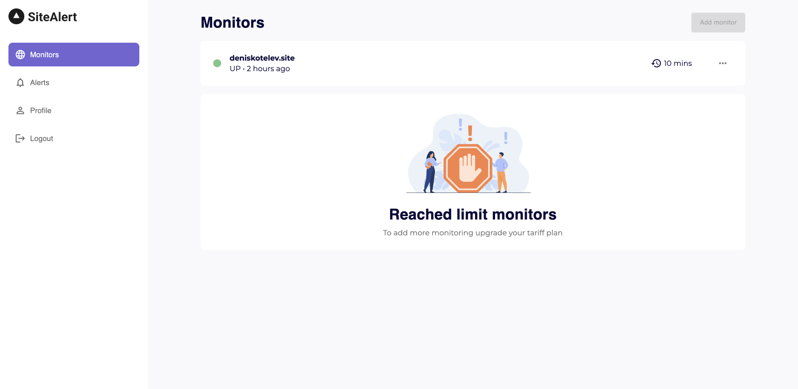

## 🚀 Alet-backend - monitoring app

<p align="center">
  
</p>

## Basic Overview
<p>
 <div>
    This is a simple website monitoring app built with NestJS, prisma
 </div>
  <div>
    Frontend repository https://github.com/hardsmile98/alert-main
 </div>
</p>

## Getting started 
```javascript
/* First, Install the needed packages */
yarn

/* Set envs */

/* Generate the prisma client from the migrated database */
npx prisma generate

/* Start application */
yarn start:dev
```

## Swagger API docs
<p>
  This example repo uses the NestJS swagger module for API documentation.
</p>
